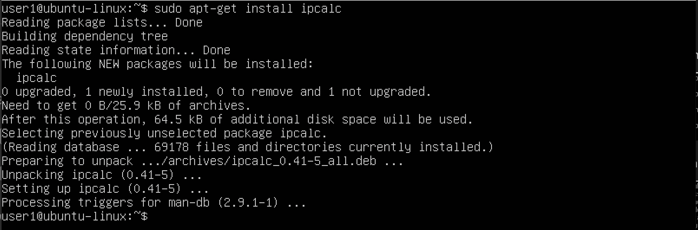

## Part 1. ipcalc tool

- there is no ipcalc tool.

- installing ipcalc. $ sudo apt install ipcalc

### 1.1 Networks and Masks

1. Network address of 192.167.38.54/13

2. Conversion of the mask 255.255.255.0 to prefix and binary, /15 to normal and binary, 11111111.11111111.11111111.11110000 to normal and prefix

- сonversion of the mask 255.255.255.0 to prefix and binary

- /15 to normal and binary

- 11111111.11111111.11111111.11110000 to normal and prefix

3. Minimum and maximum host in 12.167.38.4 network with masks: /8, 11111111.11111111.00000000.00000000, 255.255.254.0 and /4

- /8

- 11111111.11111111.00000000.00000000

- 255.255.254.0

- /4

### 1.2 Localhst
- can be accessed with
    + 127.0.0.2
    + 127.1.0.1
- can't with
    + 194.34.23.100
    + 128.0.0.1

### 1.3. Network ranges and segments

1. Which of the listed IPs can be used as public and which only as private: 10.0.0.45, 134.43.0.2, 192.168.4.2, 172.20.250.4, 172.0.2.1, 192.172.0.1, 172.68.0.2, 172.16.255.255, 10.10.10.10, 192.169.168.1

- private
    + 10.0.0.45
    + 192.168.4.2
    + 172.20.250.4
    + 172.16.255.255
    + 10.10.10.10

- public
    + 134.43.0.2
    + 172.0.2.1
    + 192.172.0.1
    + 172.68.0.2
    + 192.169.168.1

2. Which of the listed gateway IP addresses are possible for 10.10.0.0/18 network: 10.0.0.1, 10.10.0.2, 10.10.10.10, 10.10.100.1, 10.10.1.255

- possible
    + 10.10.0.2
    + 10.10.10.10
    + 10.10.1.255

- impossible
    + 10.0.0.1
    + 10.10.100.1

## Part 2. Static routing between two machines

- Start two virtual machines (hereafter -- ws1 and ws2)

- View existing network interfaces with the ip a command 
    - Add a screenshot with the call and output of the used command to the report.

- Describe the network interface corresponding to the internal network on both machines and set the following addresses and masks: ws1 - 192.168.100.10, mask */16 *, ws2 - 172.24.116.8, mask /12
    - Add screenshots of the changed etc/netplan/00-installer-config.yaml file for each machine to the report.
    - sudo nano /etc/netplan/00-installer-config.yaml

    - sudo netplan apply

    - after network applied

### 2.1. Adding a static route manually

- Add a static route from one machine to another and back using a 'ip r add' command.

- Ping the connection between the machines. Add a screenshot with the call and output of the used commands to the report.

### 2.2. Adding a static route with saving

- Restart the machines

- Add static route from one machine to another using etc/netplan/00-installer-config.yaml file. Add screenshots of the changed etc/netplan/00-installer-config.yaml
file to the report.

- Ping the connection between the machines. Add a screenshot with the call and output of the used commands to the report.

## Part 3. iperf3 utility

- In this task you need to use ws1 and ws2 from Part 2.

- No iperf3, installing it.

There is no internet connection. So to download iperf3 these steps are needed to be done:
   + Turn on the second interface to be able to set up the Internet.
   + Turn on DHCP for the second interface in the netplan. sudo nano /etc/netplan/00-interface-config.yaml

   + Netplan apply.
   + Ping an address to be sure that it works

- Successfull installation

- Also installed on ws2

### 3.1. Connection speed

- Convert and write results in the report: 8 Mbps to MB/s, 100 MB/s to Kbps, 1 Gbps to Mbps

    + 8Mbps -> 1MB/s
    + 100MB/s -> 819200Kbps
    + 1Gbps -> 1024Mbps

### 3.2. iperf3 utility

- Measure connection speed between ws1 and ws2. Add a screenshots with the call and output of the used commands to the report.

   + $ sudo apt-get install iperf3
   + On the server $ iperf3 -s
   + On the client $ iperf3 -c 172.24.116.8 -p 5201
